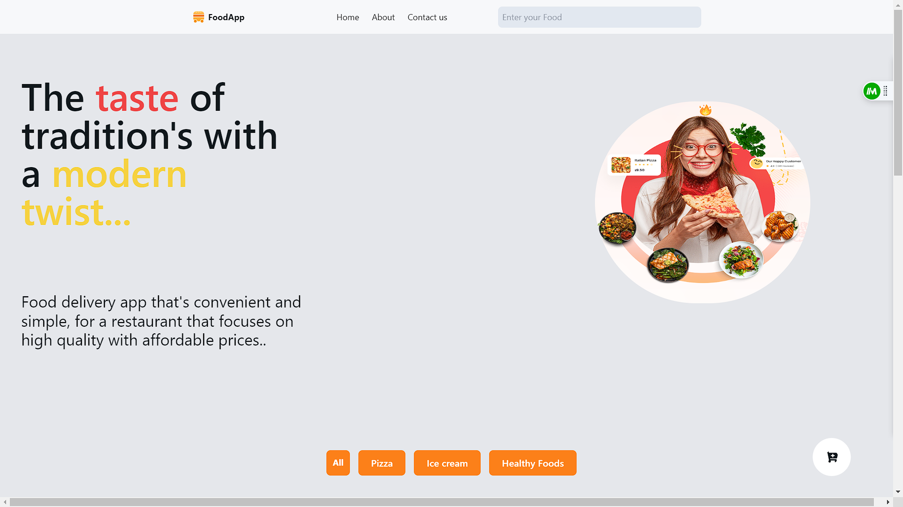
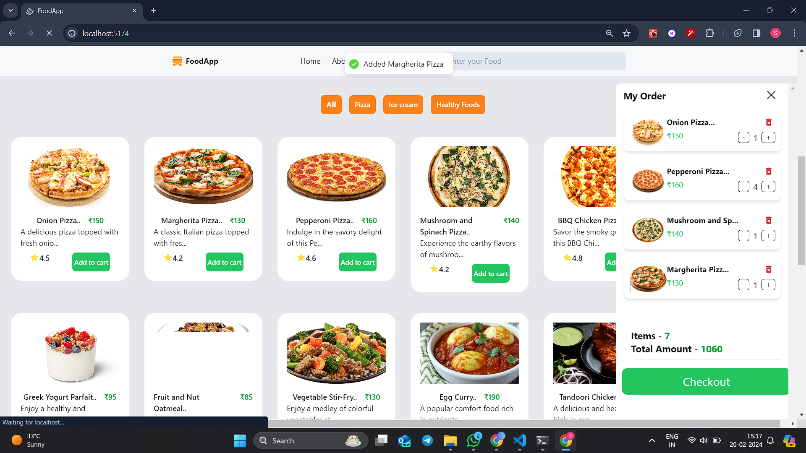
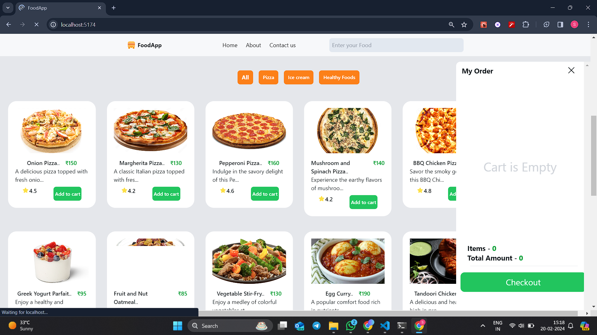
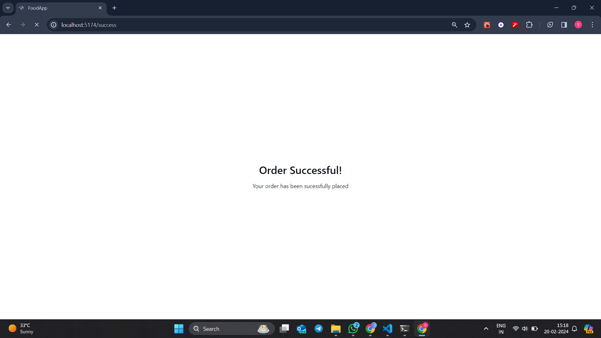

<h2 align="center">FoodApp
  <br/>
  <br/>
<div align="center">
  
</div>
</h2>
<br/>

#Add to cart
<div align="center">
  
</div>
<hr/>
#Remove from the Cart
<div align="center">
  
</div>
<hr/>
#checkout
<div align="center">
  
</div>
<hr/>

# Getting Started

1. Clone the repository:

 ```bash
   git clone https://github.com/shrikantg199/FoodApp.git
   ```
 

2. Install dependencies:

   ```bash
   cd your-repository
   npm install
   ```

3. Configure the backend:

   - Follow the instructions in the backend repository to set up your server and database.

4. Start the frontend development server:

   ```bash
   npm run dev
   ```

5. Open your browser and visit [http://localhost:5173](http://localhost:5173) to view the application.
